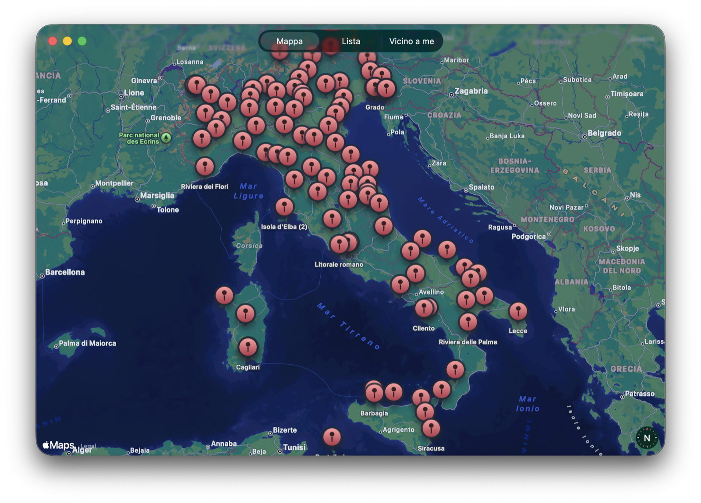

# 4 Ristoranti - App SwiftUI

Applicazione SwiftUI che visualizza le puntate di "4 Ristoranti" su mappa, in lista e in base alla distanza dalla posizione utente.

## Panoramica

Il progetto usa un dataset JSON locale (`4ristoranti.json`) con informazioni su:

- anno, stagione e puntata
- location e tema
- concorrenti, vincitore e titolare
- coordinate geografiche (quando disponibili)

L'app e composta da tre sezioni principali:

- Mappa: visualizzazione delle location su MapKit
- Lista: elenco puntate raggruppato per stagione con ricerca testuale
- Vicino a me: top 5 location piu vicine alla posizione attuale

## Funzionalita principali

- Caricamento dati locale dal bundle tramite `DataService`
- Modellazione episodio con parsing date e coordinate (`Episode`)
- Mappa interattiva con marker raggruppati per coordinate condivise
- Scheda dettaglio puntata con link di ricerca concorrenti
- Ricerca testuale su location, vincitore, concorrenti e tema
- Ordinamento stagioni dalla piu recente alla piu vecchia
- Geolocalizzazione utente per suggerire i ristoranti piu vicini

## Stack tecnico

- Swift
- SwiftUI
- MapKit
- CoreLocation
- Xcode project (`ristoranti.xcodeproj`)

## Struttura del repository

- `ristoranti/`: codice sorgente app SwiftUI
- `ristoranti/4ristoranti.json`: dataset episodi (attualmente 130 episodi)
- `geocoding.py`: script Python per arricchire i dati con latitudine/longitudine
- `build_and_package.sh`: build release e generazione DMG
- `build/`: output build locali (ignorabile in una pipeline CI)

## Requisiti

- macOS
- Xcode con supporto SwiftUI

Nota: il target del progetto e configurato per piattaforma macOS.

## Avvio in locale

1. Apri `ristoranti.xcodeproj` in Xcode.
2. Seleziona schema `ristoranti`.
3. Esegui il progetto.

## Permessi posizione

La vista "Vicino a me" richiede il consenso alla localizzazione.

Chiave configurata nel progetto:

- `NSLocationWhenInUseUsageDescription`: "Usiamo la tua posizione per mostrarti i ristoranti vicini."

## Packaging DMG

E possibile creare un build release e un DMG con lo script incluso:

1. Rendi eseguibile lo script (solo la prima volta):
	`chmod +x build_and_package.sh`
2. Esegui lo script:
	`./build_and_package.sh`

Output atteso:

- app compilata in `build/DerivedData/.../Release/ristoranti.app`
- installer in `build/4Ristoranti.dmg`

## Rilevamento errori di build

Per estrarre velocemente gli errori della compilazione in un report leggibile:

1. Rendi eseguibile lo script (solo la prima volta):
	`chmod +x detect_build_errors.sh`
2. Esegui analisi build Release:
	`./detect_build_errors.sh`
3. Oppure analisi build Debug:
	`./detect_build_errors.sh Debug`

Lo script salva:

- log completo in `build/logs/build_<CONFIG>_<timestamp>.log`
- report errori in `build/logs/build_errors_<CONFIG>_<timestamp>.txt`

## Pipeline dati

Flusso consigliato:

1. Parti dal dataset JSON base.
2. Arricchisci con coordinate tramite `geocoding.py` e API OpenCage.
3. Copia il JSON finale in `ristoranti/4ristoranti.json` (incluso nel bundle app).

Lo script `geocoding.py` salva in modo incrementale, utile per dataset lunghi e limiti API.